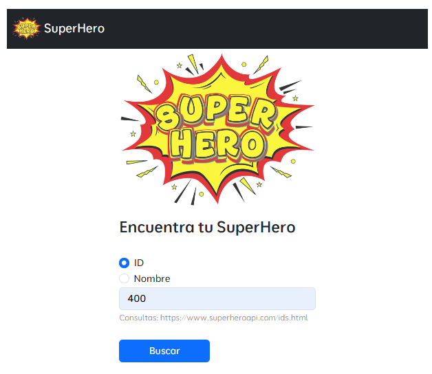
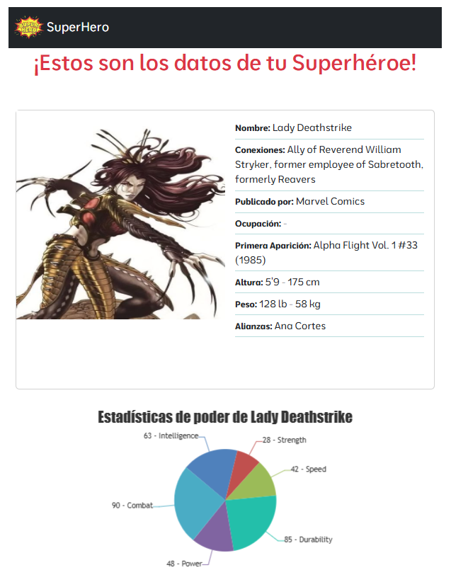

# **MEET YOUR SUPERHERO [](https://github.com/YADICEP)**

## Description
The application is designed to retrieve information about superheroes using the <a href="https://www.superheroapi.com/" target="_blank">Superhero API</a>


## Technologies Used
HTML5, CSS3, Pure JavaScript

## Features
1. **Search Interface**: The HTML file includes a form interface that allows users to search for heroes. Options are available for searching by either ID or name.
2. **Search Logic with JavaScript and jQuery**:
   - **Search Type Selection**: When switching between ID and name search types, specific fields are shown or hidden depending on the choice.
   - **Search by ID or Name**: When the user submits the form, the script checks if the search is by ID or name and validates the input. If valid, a specific function (`infoID` or `infoName`) is called to retrieve the hero's information.
3. **Alerts and Validation**: The application validates the user's input and displays alerts if the input is incorrect.

## Screenshots
<p align="center">
  
</p>

<p align="center">
  
</p>

## Installation
1. Clone the repository
   ```bash
   git clone  https://github.com/YADICEP/SUPER_HERO.git

